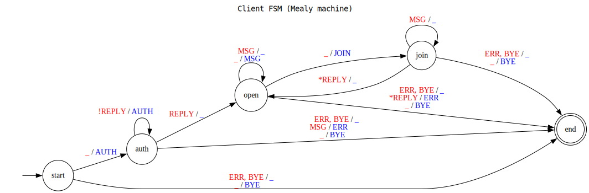

# IPK Projekt 2: Klient pre IPK25-CHAT Protokol

**Autor:** Lukas Medovic (`xmedovl00`)

---

## Popis Projektu

Toto je C# klient pre IPK25-CHAT protokol (.NET 9). Implementoval som TCP aj UDP varianty. Klient umoznuje pripojenie na server, autentifikaciu a chatovanie.

## Funkcionalita

* Podpora TCP aj UDP (`-t`)
* Pripojenie k serveru (`-s host -p port`)
* Autentifikacia: automaticka (`--user`/`--secret`/`--name`) alebo manualna (`/auth`)
* Posielanie/prijimanie sprav (`MSG`)
* Praca s kanalmi (`/join`)
* Zmena mena (`/rename`)
* Napoveda (`/help`)
* UDP Spolahlivost: `CONFIRM`, Retry (`-d`/`-r`), Timeouty, Detekcia duplikatov
* Spracovanie chyb (`ERR`, `REPLY NOK`, timeouty)
* Korektne ukoncenie (`Ctrl+C`/`D` posle `BYE`)

## Pouzity jazyk, platforma a kniznice

* Jazyk: C#
* Platforma: .NET 9
* Kniznice: `Microsoft.Extensions.Hosting`, `Logging`, `System.Net.Sockets`, `System.Collections.Concurrent`

## Popis Implementacie

* **Kod:** Logika v `Program.cs` (`Program` + `ChatService : IHostedService`). Pomocne `UdpPacketBuilder`/`Parser`.
* **Concurrency:** `async/await` pre siet, `Task.Run` pre konzolu/siet, `BlockingCollection` pre komunikaciu medzi nimi.
* **Logika:** Stavovy automat (`ClientState`) riadi povolene akcie (napr. `MSG` az po `AUTH`). UDP spolahlivost (`CONFIRM`/retry/timeout/duplikaty) riesena cez `ConcurrentDictionary`.
* **Vstup/Vystup:** Prikazy z konzoly sa parsuju jednoduchym splitom. Odpovede a spravy sa vypisuju na `stdout`, logy na `stderr`.
* **Chyby:** Sietove chyby a errory od servera (`ERR`, `REPLY NOK`) sa zachytavaju, loguju a hlasia uzivatelovi.

**Diagram Stavoveho Automatu (FSM):**

## Preklad a Spustenie

### Poziadavky

* Nainstalovany **.NET 9 SDK** alebo novsi.

### Preklad

* Debug: `dotnet build`
* Vystup najdes v `bin/Debug/net9.0/`.

### Spustenie

Su dva sposoby:

1.  Cez dotnet run (v priecinku s `.csproj`, argumenty idu za `--`):
    `dotnet run -- [argumenty...]`
2.  Priamo spustitelnym suborom (po preklade):
    * Linux/Mac: `./bin/Debug/net9.0/ipk25chat-client [argumenty...]`
    * Windows: `.\bin\Debug\net9.0\ipk25chat-client.exe [argumenty...]`

### Argumenty

* **`-t <tcp|udp>`**: Protokol.
* **`-s <server>`**: Adresa servera.
* **`-p <port>`**: Port (default: `4567`).
* **`--user <username>`**:  Meno pre auto-login.
* **`--secret <secret>`**: Heslo pre auto-login.
* **`--name <displayName>`**: Nick pre auto-login.
* **`-d <ms>`**: (UDP) Timeout pre `CONFIRM` (default: `250`).
* **`-r <pocet>`**: (UDP) Max pocet retry (default: `3`).
* **`-h`** alebo **`--help`**: Zobrazi napovedu.

### Priklady

**TCP klient s auto-loginom:**
`dotnet run -- -t tcp -s anton5.fit.vutbr.cz --user login --secret token --name meno`

**UDP klient s auto-loginom, upraveny timeout/retry:**
`dotnet run -- -t udp -s anton5.fit.vutbr.cz -d 500 -r 5 --user login --secret token --name meno`

**TCP klient bez auto-loginu (prihlasenie cez `/auth`):**
`dotnet run -- -t tcp -s 127.0.0.1 -p 12345`

**Zobrazenie napovedy:**
`dotnet run -- -h`

## Testovanie

Testoval som manualne na servery (`anton5.fit.vutbr.cz`) cez TCP aj UDP. Skusal som hlavne:

* Pripojenie, login (aj zly), posielanie sprav.
* Prikazy (`/join`, `/rename`, `/help`).
* Reakcie na chyby a nespravny vstup.
* Korektne ukoncenie (`Ctrl+C`).
* Pre UDP: `CONFIRM` mechanizmus, `retry`, ignorovanie duplikatov. Mal som problem s `REPLY` spravami cez NAT/firewall, ale cez VPN to fungovalo (takze chyba nebola v klientovi).

Tiez som pouzil jednoduchy Python skript na lokalne testovanie UDP (viac informacii v changelogu).

Overoval som cez vystup programu a logy na `stderr`.

## Zdroje

1.  Specifikacia protokolu IPK25-CHAT.
2.  Dokumentacia .NET (`learn.microsoft.com`).
3.  Konzultacie a forum k predmetu.
